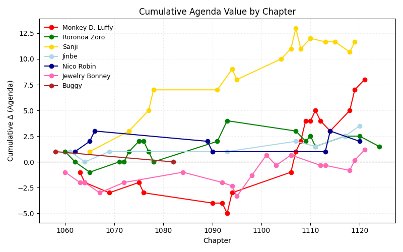

# Narrative Analyzer 🧠📊

A lightweight research tool for quantifying narrative sentiment and character influence in serialized storytelling.  
This repository analyzes stories by extracting emotional “impact deltas” from text events and mapping them into a structured database.

## 🧩 Overview
**Narrative Analyzer** processes character-centric event data and computes sentiment-based influence metrics using pre-trained language models.  
The system is designed for use with serialized works (e.g., manga, novels, or scripts) and outputs interpretable numeric indices representing each character’s narrative momentum.

## 🏗️ File Structure
```
narrative-analysis/
│
├── characters/           # Individual JSON or text files per character
│   ├── Luffy.json
│   ├── Zoro.json
│   └── …
├── analyze_run.py        # Experimental entry point for data ingestion
├── berry_index.py        # Handles data aggregation and index updates
├── process-core.py       # Core sentiment and impact computation logic
├── visualize.py          # Visualization of impact deltas and trends
├── data_store.db         # SQLite database storing computed deltas and metadata
└── README.md
```

## ⚙️ How It Works

1. **Event Parsing:**  
   Each character file lists chronological events with context and chapter metadata.
2. **Sentiment Scoring:**  
   The `process_core.py` script runs a transformer model (Hermes) to generate sentiment scores per event.
3. **Database Integration:**  
   Results are committed to `data_store.db`, which indexes characters, chapters, and computed scores.
4. **Visualization:**  
   `visualize.py` generates comparative plots of sentiment trajectories and inter-character relationships.

## 🧪 Research Context

This project explores *quantitative storytelling* by treating narrative beats as time-series data.  
Preliminary findings show strong correlation between aggregate sentiment and audience engagement metrics in serialized fiction.

Key analytical directions:
- Identifying **narrative volatility** per character  
- Measuring **inter-arc sentiment drift**  
- Modeling **emotional network graphs** between major actors

## 📈 Results (Sample Visualization)


## 💾 Usage
```bash
# Step 1: Run sentiment pipeline and aggregate the data
python3 process_core.py; python3 berry_index.py

# Step 2: Generate database plots
python3 plot.py
```
